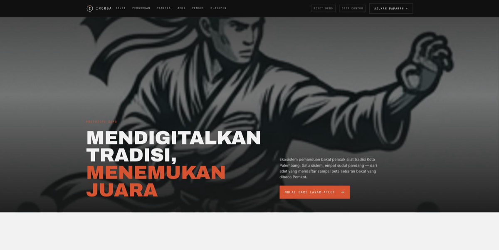
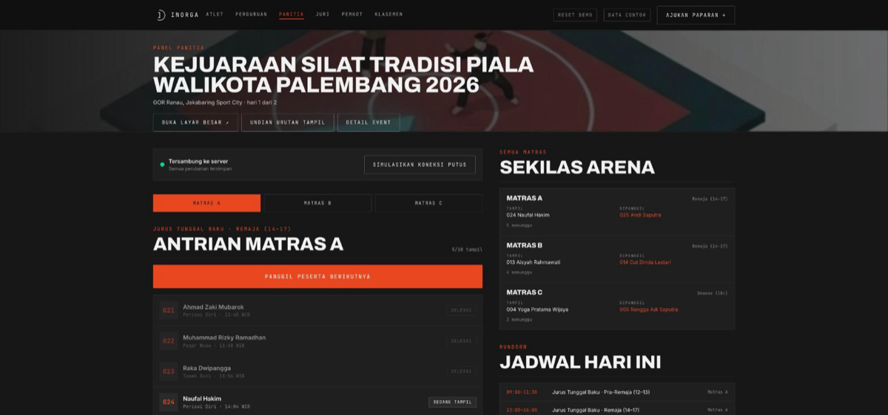
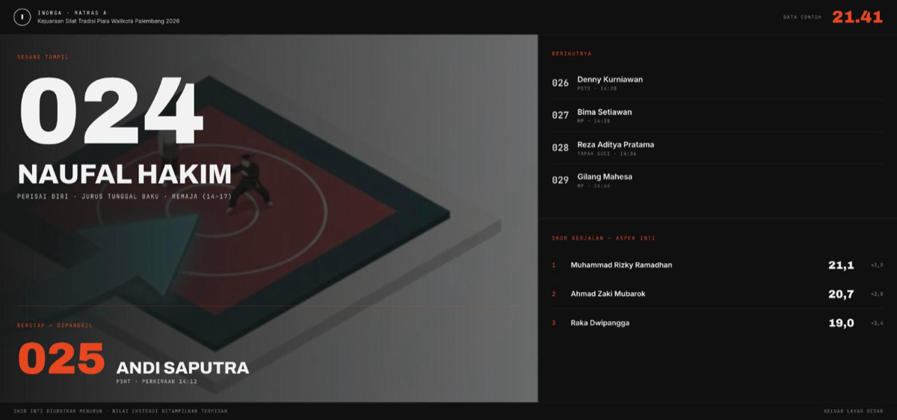
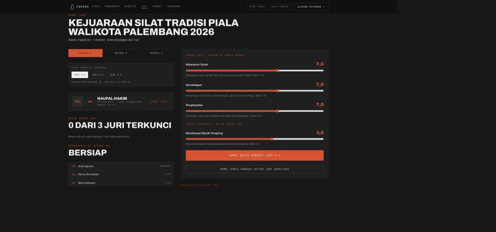
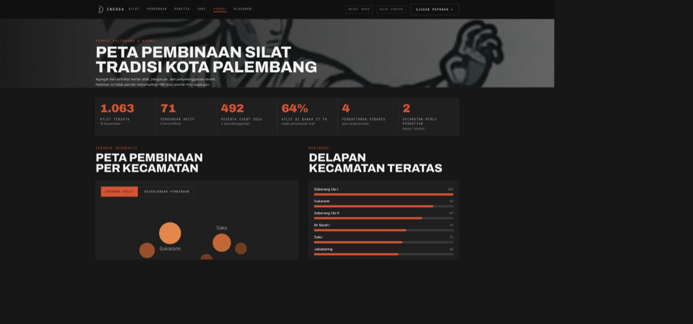
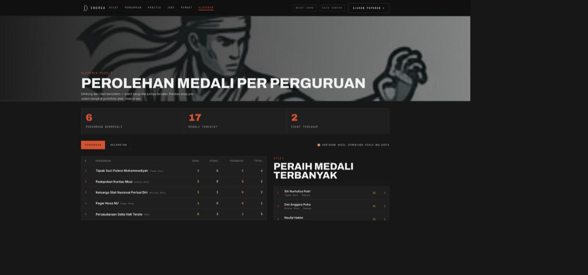
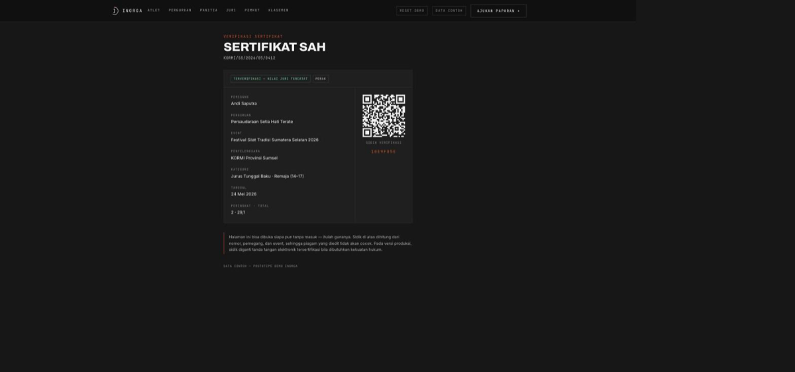
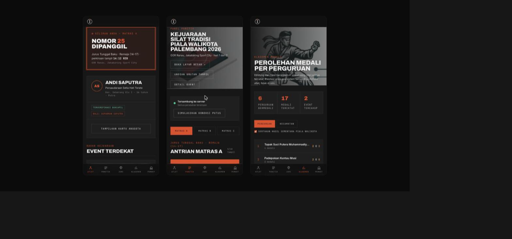

<div align="center">


# INORGA — Ekosistem Digital Pemanduan Bakat Pencak Silat

**Satu aplikasi, lima sudut pandang — atlet, perguruan, panitia, juri, dan Pemkot melihat data yang sama, secara real-time.**

[](#)
[](#)
[](LICENSE)

</div>

> Powered by **Arah Karya Sinergi (AKS)** × **NOZ Berkarya**.

Pencak silat tradisi di Kota Palembang punya ribuan atlet aktif, puluhan
perguruan, dan event rutin lintas kecamatan — tapi selama ini **tidak pernah
terdata**. Siapa bertanding di matras mana, kapan giliran naik, siapa yang
sudah verifikasi identitas, siapa yang butuh rapor perkembangan: semua masih
di kertas dan grup WhatsApp. **INORGA** adalah prototipe demo untuk tahap
penawaran ke Pemkot Palembang dan KORMI — satu sumber data, empat peran yang
melihatnya dari sudut berbeda.

## 🖼️ Tangkapan Layar

### Beranda


### Panitia & papan skor arena — momen dua layar
Panitia menekan "Panggil peserta berikutnya" di ponsel; papan skor di proyektor
berubah tanpa reload, tersinkron lewat event `storage`.

| Panel panitia | Papan skor arena |
|---|---|
|  |  |

### Panel juri — aspek inti dan ekstensi dipisah


### Dashboard Pemkot & KORMI


### Klasemen medali


### Verifikasi sertifikat publik
Bisa dibuka siapa pun tanpa masuk; sidik dihitung dari nomor, pemegang, dan event.



### Tampilan ponsel
Navigasi peran pindah ke bawah, tabel berubah jadi kartu, tidak ada geser samping.



## ✨ Kenapa INORGA

| Masalah                                                | Solusi                                                                                 |
| ------------------------------------------------------ | -------------------------------------------------------------------------------------- |
| 1.063 atlet & 74 perguruan tak pernah terdata terpusat | Basis data tunggal per atlet: identitas, perguruan, riwayat event                      |
| Panitia panggil peserta lewat pengeras suara/manual    | Panel panitia: antrian matras + tombol panggil, status berubah langsung di layar atlet |
| Pengurus perguruan kumpulkan fotokopi berkas manual    | Pendaftaran kolektif per perguruan, kelengkapan data terpantau                         |
| Pemkot & KORMI tak punya gambaran sebaran bakat        | Dashboard kota: peta sebaran, peringkat kecamatan, statistik event                     |
| Anak di bawah umur ikut event tanpa jalur consent      | Model atlet menyertakan wali — sesuai kewajiban UU PDP                                 |
| Koneksi GOR tidak bisa diandalkan                      | Mode luring di panel panitia — simulasi putus-sambung sudah dirancang dari awal        |

## 🏛️ Arsitektur

```
                     ┌────────────────────────┐
                     │   src/data/  (contoh)  │
                     │  atlet · perguruan     │
                     │  event · penilaian     │
                     │  wilayah               │
                     └───────────┬────────────┘
                                 │  (produksi → Postgres + Prisma)
              ┌──────────────────┼──────────────────┬──────────────────┐
              ▼                  ▼                   ▼                  ▼
        ┌───────────┐     ┌────────────┐      ┌────────────┐    ┌────────────┐
        │  Beranda  │     │   Atlet    │      │  Panitia   │    │  Perguruan │
        │  skala &  │     │ QR, rapor, │      │  antrian   │    │  binaan &  │
        │  ringkasan│     │ portofolio │      │  & panggil │    │  daftar    │
        └───────────┘     └────────────┘      └─────┬──────┘    └────────────┘
                                                      │ status real-time
                                                      ▼
                                              ┌────────────────┐
                                              │ Pemkot & KORMI │
                                              │ peta sebaran & │
                                              │ peringkat kec. │
                                              └────────────────┘
```

Pengalih peran (`DemoBar.tsx`) di bilah atas memungkinkan lompat antar-peran
kapan saja di depan audiens, tanpa logout/login.

## 🔁 Pipeline — alur presentasi

Urutan disengaja: pengalaman individu dulu, dampak kelembagaan terakhir.
Pengambil keputusan baru percaya pada peta setelah melihat dari mana datanya berasal.

| #   | Layar                   | Yang ditunjukkan                                                                         | Kalimat pembuka                                                            |
| --- | ----------------------- | ---------------------------------------------------------------------------------------- | -------------------------------------------------------------------------- |
| 1   | **Beranda**             | Skala: 1.063 atlet, 71 perguruan, 18 kecamatan                                           | "Ini yang selama ini tidak pernah terdata."                                |
| 2   | **Atlet**               | Panggilan arena real-time, kartu QR, daftar 1 klik, rapor, portofolio bersertifikat      | "Andi, 16 tahun, sedang menunggu giliran di Jakabaring."                   |
| 3   | **Panitia** + **Arena** | Antrian matras, tombol panggil, mode luring; papan skor layar besar di `/arena/matras-a` | "Panitia menekan satu tombol — layar arena dan HP Andi berubah bersamaan." |
| 4   | **Juri**                | Nilai aspek inti + ekstensi, rerata terpangkas, kunci                                    | "Tiga juri, tiga tablet, nol tabulasi manual."                             |
| 5   | **Hasil & Klasemen**    | `/event/e-walikota/hasil` lalu `/klasemen`                                               | "Nilai yang baru dikunci langsung jadi peringkat dan medali."              |
| 6   | **Undian**              | Urutan tampil dengan benih tercatat, verifikasi ulang                                    | "Siapa pun bisa mengulang perhitungannya."                                 |
| 7   | **Perguruan**           | Binaan (klik → profil), pendaftaran kolektif                                             | "Pengurus tidak perlu lagi mengumpulkan fotokopi."                         |
| 8   | **Pemkot & KORMI**      | Peta sebaran → toggle peta kesenjangan                                                   | "Bukan hanya di mana atlet ada — tapi di mana pembinaan belum ada."        |

**Momen paling kuat — dua layar.** Buka `/arena/matras-a` di proyektor dan
`/panitia` di HP. Tekan "Panggil peserta berikutnya" — papan skor berubah
tanpa reload (sinkron lewat `localStorage` + event `storage`). Lalu buka
`/juri`, kunci nilai untuk peserta yang tampil — skor berjalan di arena,
hasil sementara, klasemen, dan rapor atlet ikut berubah.

Tombol **Reset demo** di bilah atas mengembalikan semua ke keadaan awal
sebelum presentasi berikutnya.

## ⚠️ Yang disimulasikan (belum sungguhan)

Seluruh data adalah **data contoh**. Nama atlet fiktif. Nama perguruan
nasional dipakai karena organisasi itu memang ada di Palembang, tetapi
seluruh atributnya — pengurus, tahun berdiri, jumlah anggota, kecamatan
kedudukan — dikarang untuk keperluan demo dan tidak berasal dari sumber
resmi organisasi mana pun. Bilah atas menandai ini secara permanen agar
tidak ada salah paham saat presentasi.

| Fitur               | Status demo                                                                                             |
| ------------------- | ------------------------------------------------------------------------------------------------------- |
| Verifikasi Dukcapil | Lencana "terverifikasi" masih simulasi — akses via Pemkot sudah dipastikan tersedia, PKS belum berjalan |
| OTP WhatsApp        | Belum ada — login dilewati untuk demo                                                                   |
| Basis data          | Statik di `src/data/`, belum di Postgres                                                                |
| Sinkronisasi luring | Tombol "Simulasikan koneksi putus" memperagakan perilaku, belum ada lapisan sinkronisasi sungguhan      |

Jangan menjanjikan keempatnya sebagai sudah jalan. Tunjukkan sebagai alur.

## 🧭 Keputusan desain dari bedah kelayakan

Prototipe ini bukan sekadar tampilan — beberapa keputusan struktural sudah
mengikuti temuan dokumen bedah kelayakan, supaya bisa dilanjutkan ke
produksi tanpa ditulis ulang.

- **NIK tidak disimpan** (`src/lib/types.ts`). Karena akses verifikasi
  Dukcapil tersedia, yang perlu disimpan hanya status verifikasi dan hash
  untuk deteksi duplikat. Aset paling berisiko hilang tanpa kehilangan manfaatnya.
- **Wali sebagai bagian model atlet**. Umur minimum 12 tahun berarti
  mayoritas pengguna adalah anak; UU PDP mewajibkan persetujuan wali.
- **Penilaian sebagai baris, bukan kolom** (`src/data/penilaian.ts`). Aspek
  inti wajib sama di semua event agar tren lintas-event mungkin; aspek
  ekstensi bebas per penyelenggara. Tanpa pemisahan ini, janji "tren nilai
  historis" tidak bisa ditepati.
- **Pendaftaran dibantu** (`didaftarkanOleh`). Karena semua event diwajibkan
  pindah ke aplikasi, harus ada jalur bagi atlet tanpa ponsel.
- **Mode luring pada panel panitia**. Koneksi di GOR tidak bisa diandalkan.

## 📁 Struktur Repo

```
src/
├── app/
│   ├── (utama)/          # layar biasa: bilah peran + gulir halus
│   │   ├── page.tsx      # beranda
│   │   ├── atlet/[id]    # profil atlet (persona demo di /atlet)
│   │   ├── perguruan/    # binaan → klik ke profil
│   │   ├── panitia/      # antrian arena & check-in
│   │   ├── juri/         # panel penilaian (peran ke-5)
│   │   ├── pemkot/       # dashboard kota + peta kesenjangan
│   │   ├── klasemen/     # medali per perguruan & kecamatan
│   │   ├── event/[id]    # detail event + /hasil
│   │   ├── undian/       # undian berbenih yang bisa diverifikasi
│   │   └── sertifikat/[slug]  # verifikasi publik
│   └── (layar)/arena/[id]     # papan skor proyektor, tanpa bilah
├── components/           # DemoBar, ProfilAtlet, charts, motion, ui
├── data/                 # data contoh; nilai juri & hasil DIBANGKITKAN dari skor target
└── lib/                  # turunan murni: hasil, klasemen, undian, kesenjangan, sertifikat, simpan
```

Konsistensi data dijamin secara konstruksi: `HASIL` diturunkan dari `NILAI`,
`NILAI` dibangkitkan dari skor target, antrian Matras A diturunkan dari
rekaman undian berbenih. `src/data/cek.ts` memeriksa sisanya.

## 🚀 Quickstart

```bash
pnpm install
pnpm dev          # http://localhost:3000
```

## ✅ Status

- [x] Lima peran (Atlet, Panitia, Juri, Perguruan, Pemkot/KORMI) dengan pengalih demo
- [x] Model data mengikuti temuan bedah kelayakan (NIK, wali, penilaian per-baris)
- [x] Palet grafik tervalidasi buta warna
- [x] Papan skor arena tersinkron antar-tab/perangkat
- [x] Klasemen, hasil event (inti | ekstensi), verifikasi sertifikat publik
- [x] Undian berbenih yang bisa direproduksi
- [x] Peta kesenjangan pembinaan
- [ ] Verifikasi Dukcapil (PKS belum berjalan)
- [ ] OTP WhatsApp
- [ ] Backend Postgres + Prisma (masih statik di `src/data/`)
- [ ] Sinkronisasi luring sungguhan
- [ ] Hosting produksi di wilayah Indonesia (wajib — status PSE Lingkup Publik, PP 71/2019 Pasal 20)

## 📱 Aplikasi mobile

Dua bentuk dari satu basis kode:

**PWA** — buka di peramban ponsel lalu "Tambahkan ke layar utama". Dapat ikon
sendiri, layar penuh tanpa bilah peramban, dan service worker (`public/sw.js`)
sehingga **mode luring panitia jadi nyata**, bukan simulasi: halaman yang pernah
dibuka tetap terbuka saat sinyal GOR hilang, dan state antrian hidup di
localStorage.

**APK Android** — cangkang Capacitor membungkus ekspor statis, jadi aplikasi
berjalan penuh tanpa server.

```bash
pnpm apk:build     # ekspor statis → sync → assembleDebug
pnpm apk:pasang    # sekaligus pasang ke perangkat yang tersambung (adb)
```

Berkas: `android/app/build/outputs/apk/debug/app-debug.apk` (~7,5 MB).

Prasyarat sekali pasang: JDK 21 (`brew install openjdk@21` — Capacitor 8 menolak
JDK 17) dan Android SDK `platform-tools`, `platforms;android-35`,
`build-tools;35.0.0`. Jalur JDK sudah ditetapkan di `android/gradle.properties`.

`next.config.ts` punya dua sasaran: `standalone` (default, untuk Docker/RPi5) dan
`export` bila `INORGA_TARGET=apk`. Karena ekspor statis melarang param dinamis,
seluruh `dynamicParams` bernilai `false` — semua id berasal dari data contoh, jadi
setiap halaman sah sudah dirender di muka; id tak dikenal jatuh ke halaman
tidak-ditemukan.

Fitur khas perangkat: pemindai QR memakai kamera lewat `BarcodeDetector`
(`PindaiQR.tsx`, dengan tombol simulasi sebagai cadangan), getar + notifikasi
lokal saat nomor atlet dipanggil (`Perangkat.tsx`), dan navigasi bawah di layar
sempit (`NavBawah.tsx`).

## 🎞️ Footage

Gambar di `public/footage/` dipotong dari deck INORGA sendiri (hak milik
klien) — ilustrasi pesilat, matras isometrik, dan tiga thumbnail jurus.
Komponen `Footage` (`src/components/Footage.tsx`) memperlakukannya seperti
cuplikan film: desaturasi, scrim gradien ala Apex, butiran halus, gerak
Ken Burns lambat (mati bila pengguna meminta gerak dikurangi). Ganti berkas
di folder itu dengan foto sungguhan bila sudah ada — nama berkas dipakai
langsung di hero, `/klasemen`, dan `/arena/[id]`.

## 🧱 Stack

Next.js 16 · React 19 · Tailwind 4 · TypeScript · qrcode.react

**Catatan teknis:**

- Palet seri grafik divalidasi untuk buta warna (ΔE 15,5 pada deuteranopia).
- Peta melabeli 15 dari 18 kecamatan; tiga terkecil muncul saat kursor
  diarahkan, agar label tidak bertumpuk di kluster tengah.
- Saat masuk produksi, `src/data/` diganti Postgres + Prisma, dan **hosting
  wajib di wilayah Indonesia** karena sistem ini akan berstatus PSE Lingkup
  Publik (PP 71/2019 Pasal 20).

---

<div align="center">
<sub>Powered by <b>AKS × NOZ Berkarya</b><br>© 2026 Arah Karya Sinergi (AKS) &amp; NOZ Berkarya</sub>
</div>
